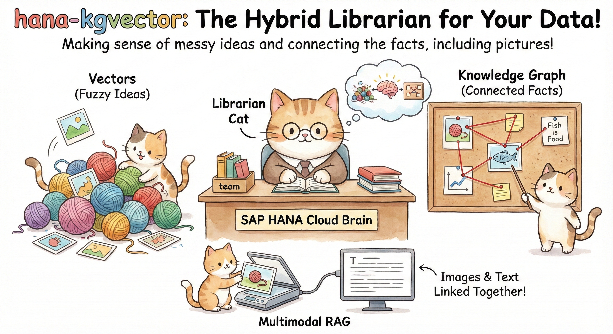

# hana-kgvector

A TypeScript framework for building **hybrid GraphRAG** applications using SAP HANA Cloud as the unified backend for knowledge graphs (RDF) and vector embeddings.


**In a Nutshell:** Think of `hana-kgvector` as a super-smart librarian cat. It uses SAP HANA as a giant brain that stores data in two ways: a messy pile of "fuzzy ideas" (Vectors) and a neat corkboard of "connected facts" (Knowledge Graph). When you ask a question, it checks both the fuzzy pile and the neat board to sew together the perfect answer.

## Features

*   **Unified Storage**: SAP HANA Cloud for both RDF triples (Knowledge Graph Engine) and vector embeddings (Vector Engine)
    
*   **Hybrid Retrieval**: Combine vector similarity search (for vague semantic matches) with graph traversal (for precise factual connections)
    
*   **Multimodal RAG Support**: Index mixed-media documents. Retrieve images or diagrams based on the semantic relevance of their surrounding text by linking them structurally in the graph.
    
*   **PropertyGraphIndex**: LlamaIndex-inspired API for building and querying property graphs
    
*   **Schema-Guided Extraction**: Extract entities and relations from documents using LLMs based on strict rules
    
*   **Multi-Tenancy**: Isolate data using separate graph names for different domains
    
*   **LLM Agnostic**: Works with any LLM via LiteLLM proxy (OpenAI, Anthropic, Azure, etc.)

> 📚 **New to hana-kgvector?** Check out the [Step-by-Step Tutorial](./TUTORIAL.md) for a complete guide.

> 🚀 **Ready for real-world examples?** See the [hana-kgvector-examples](https://github.com/skye0402/hana-kgvector-examples) repository for:
> - **Multi-Document Chat** - Full-featured Q&A with image processing and cross-document queries
> - **Graph Visualizer** - Interactive web UI to explore your knowledge graph
> - **PDF Chat** - Simple single-document example to get started

## Installation

```bash
pnpm add hana-kgvector
# or
npm install hana-kgvector
```

## Quick Start

### 1. Setup Environment

Create a `.env.local` file:

```env
# SAP HANA Cloud
HANA_HOST=your-hana-instance.hanacloud.ondemand.com:443
HANA_USER=your_user
HANA_PASSWORD=your_password

# LiteLLM Proxy
LITELLM_PROXY_URL=http://localhost:4000
LITELLM_API_KEY=your_key

# Models
DEFAULT_LLM_MODEL=gpt-4o-mini
DEFAULT_EMBEDDING_MODEL=text-embedding-3-small
```

### 2. Create a PropertyGraphIndex

```typescript
import {
  createHanaConnection,
  HanaPropertyGraphStore,
  PropertyGraphIndex,
  SchemaLLMPathExtractor,
  ImplicitPathExtractor,
} from "hana-kgvector";
import OpenAI from "openai";

// Load environment variables (user should handle this in their application)
// Example: dotenv.config({ path: ".env.local" });

// Connect to HANA
const conn = await createHanaConnection({
  host: process.env.HANA_HOST!,
  user: process.env.HANA_USER!,
  password: process.env.HANA_PASSWORD!,
});

// Create OpenAI client (via LiteLLM)
const openai = new OpenAI({
  apiKey: process.env.LITELLM_API_KEY,
  baseURL: process.env.LITELLM_PROXY_URL,
});

// Create embed model adapter
const embedModel = {
  async getTextEmbedding(text: string) {
    const res = await openai.embeddings.create({
      model: process.env.DEFAULT_EMBEDDING_MODEL ?? "text-embedding-3-small",
      input: text,
      encoding_format: "base64", // Required for some LiteLLM proxy configurations
    });
    return res.data[0].embedding;
  },
  async getTextEmbeddingBatch(texts: string[]) {
    if (texts.length === 0) return [];
    const res = await openai.embeddings.create({
      model: process.env.DEFAULT_EMBEDDING_MODEL ?? "text-embedding-3-small",
      input: texts,
      encoding_format: "base64",
    });
    return res.data.map((d) => d.embedding);
  },
};

// Create LLM client adapter
const llmClient = {
  async structuredPredict<T>(schema: any, prompt: string): Promise<T> {
    const res = await openai.chat.completions.create({
      model: process.env.DEFAULT_LLM_MODEL ?? "gpt-4o-mini",
      messages: [{ role: "user", content: prompt }],
      response_format: { type: "json_object" },
    });
    let content = res.choices[0]?.message?.content ?? "{}";
    // Strip markdown code blocks if present (some LLMs wrap JSON in ```json...```)
    content = content.replace(/^```(?:json)?\s*\n?/i, "").replace(/\n?```\s*$/i, "").trim();
    return JSON.parse(content);
  },
};

// Create HANA-backed graph store
const graphStore = new HanaPropertyGraphStore(conn, {
  graphName: "my_knowledge_graph",  // RDF named graph identifier
  // vectorDimension is auto-detected from first embedding
});

// Create PropertyGraphIndex with extractors
const index = new PropertyGraphIndex({
  propertyGraphStore: graphStore,
  embedModel,
  kgExtractors: [
    new SchemaLLMPathExtractor({
      llm: llmClient,
      schema: {
        entityTypes: ["PERSON", "ORGANIZATION", "LOCATION", "PRODUCT"],
        relationTypes: ["WORKS_AT", "LOCATED_IN", "PRODUCES", "KNOWS"],
        validationSchema: [
          ["PERSON", "WORKS_AT", "ORGANIZATION"],
          ["PERSON", "KNOWS", "PERSON"],
          ["ORGANIZATION", "LOCATED_IN", "LOCATION"],
          ["ORGANIZATION", "PRODUCES", "PRODUCT"],
        ],
      },
    }),
    new ImplicitPathExtractor(),
  ],
  embedKgNodes: true,
});
```

### 3. Insert Documents

```typescript
await index.insert([
  {
    id: "doc_1",
    text: "Alice works at SAP in Walldorf. She collaborates with Bob.",
    metadata: { documentId: "company_info" },
  },
  {
    id: "doc_2", 
    text: "SAP produces enterprise software and is headquartered in Germany.",
    metadata: { documentId: "company_info" },
  },
]);
```

### 4. Query the Graph

```typescript
// Simple query
const results = await index.query("Who works at SAP?");

for (const result of results) {
  console.log(`[${result.score.toFixed(3)}] ${result.node.text}`);
}

// Advanced: Use retriever directly
import { VectorContextRetriever } from "hana-kgvector";

const retriever = new VectorContextRetriever({
  graphStore,
  embedModel,
  similarityTopK: 5,
  pathDepth: 2,  // Traverse 2 hops from matched nodes
});

const nodes = await retriever.retrieve({ queryStr: "SAP employees" });
```

## Architecture

```
┌────────────────────────────────────────────────────────────────────┐
│                        hana-kgvector                               │
├────────────────────────────────────────────────────────────────────┤
│                                                                    │
│  ┌────────────────────┐  ┌──────────────────┐  ┌────────────────┐  │
│  │ PropertyGraphIndex │  │   Extractors     │  │  Retrievers    │  │
│  │  - insert()        │  │  - SchemaLLM     │  │  - Vector      │  │
│  │  - query()         │  │  - Implicit      │  │  - PGRetriever │  │
│  └────────┬───────────┘  └──────────────────┘  └────────────────┘  │
│           │                                                        │
│           ▼                                                        │
│  ┌──────────────────────────────────────────────────────────┐      │
│  │              HanaPropertyGraphStore                      │      │
│  │  - upsertNodes()   - vectorQuery()   - getRelMap()       │      │
│  └──────────────────────────────────────────────────────────┘      │
│           │                                                        │
│           ▼                                                        │
│  ┌──────────────────────┐    ┌─────────────────────┐               │
│  │   HANA Vector Engine │    │   HANA KG Engine    │               │
│  │   (REAL_VECTOR)      │    │   (SPARQL_EXECUTE)  │               │
│  └──────────────────────┘    └─────────────────────┘               │
│                                                                    │
└────────────────────────────────────────────────────────────────────┘
```

## Core Components

### PropertyGraphIndex

Main entry point for building and querying knowledge graphs.

```typescript
const index = new PropertyGraphIndex({
  propertyGraphStore: graphStore,  // Required: HANA-backed store
  embedModel,                       // Optional: for vector search
  kgExtractors: [...],             // Optional: extraction pipeline
  embedKgNodes: true,              // Embed entity nodes
});
```

### HanaPropertyGraphStore

HANA-backed implementation of PropertyGraphStore interface.

```typescript
const store = new HanaPropertyGraphStore(conn, {
  graphName: "my_graph",              // RDF named graph identifier
  vectorTableName: "MY_VECTORS",      // Optional: custom table name
  // vectorDimension auto-detected from embeddings (supports 1536, 3072, etc.)
});
```

### Extractors

Transform text nodes into entities and relations.

| Extractor | Description |
|-----------|-------------|
| `SchemaLLMPathExtractor` | Schema-guided extraction with LLM |
| `ImplicitPathExtractor` | Extract structure-based relations (CHUNK → DOCUMENT) |
| `AdjacencyLinker` | Create structural edges between adjacent chunks (same page, sequential) |

### Retrievers

Retrieve relevant context from the graph.

| Retriever | Description |
|-----------|-------------|
| `VectorContextRetriever` | Vector similarity → graph traversal |
| `PGRetriever` | Orchestrates multiple sub-retrievers |

## Configuration Reference

### HanaPropertyGraphStore Options

| Parameter | Type | Default | Description |
|-----------|------|---------|-------------|
| `graphName` | `string` | Required | RDF named graph identifier (e.g., `"my_knowledge_graph"`) |
| `vectorTableName` | `string` | Auto-generated | Custom table name for vector storage |
| `documentNodesTableName` | `string` | Auto-generated | Custom table name for document nodes |
| `resetTables` | `boolean` | `false` | Drop and recreate tables on init (dev/test only) |

### Graph Discovery

If you're using a shared HANA schema (e.g. for demos or multiple apps), you can discover existing graphs created with hana-kgvector's table naming conventions:

```typescript
import { createHanaConnection, listGraphs, getGraphTables } from "hana-kgvector";

const conn = await createHanaConnection({
  host: process.env.HANA_HOST!,
  port: parseInt(process.env.HANA_PORT || "443"),
  user: process.env.HANA_USER!,
  password: process.env.HANA_PASSWORD!,
});

const graphs = await listGraphs(conn, {
  // schema: "MY_SCHEMA",            // optional (defaults to CURRENT_SCHEMA)
  // includeCounts: true,             // optional (row counts; can be expensive)
  require: ["VECTORS", "NODES"],    // optional filter
});

for (const g of graphs) {
  console.log(g.graphName, g.hasVectors, g.hasNodes, g.hasImages);
  console.log(getGraphTables(g.graphName));
}
```

### PropertyGraphIndex Options

| Parameter | Type | Default | Description |
|-----------|------|---------|-------------|
| `propertyGraphStore` | `PropertyGraphStore` | Required | HANA-backed graph store instance |
| `embedModel` | `EmbedModel` | - | Embedding model for vector search |
| `kgExtractors` | `TransformComponent[]` | `[ImplicitPathExtractor]` | Pipeline of entity/relation extractors |
| `embedKgNodes` | `boolean` | `true` | Generate embeddings for extracted entity nodes |
| `showProgress` | `boolean` | `false` | Log progress during extraction |
| `maxEmbedChars` | `number` | `28000` | Max characters per text sent to the embedding model. Texts exceeding this are truncated before embedding. Default is safe for 8192-token models like `text-embedding-3-small`. |

### Query/Retrieval Options

These options can be passed to `index.query()` or `index.asRetriever()`:

| Parameter | Type | Default | Description |
|-----------|------|---------|-------------|
| `similarityTopK` | `number` | `4` | Number of top similar nodes to retrieve via vector search |
| `pathDepth` | `number` | `1` | Graph traversal depth (hops) from matched nodes |
| `limit` | `number` | `30` | Maximum triplets/results to return after graph expansion |
| `similarityScore` | `number` | - | Minimum similarity threshold (0.0-1.0) to filter results |
| `crossCheckBoost` | `boolean` | `true` | Enable cross-check boosting (see below) |
| `crossCheckBoostFactor` | `number` | `1.25` | Score multiplier for cross-check matches |
| `includeStructuralEdges` | `boolean` | `true` | Traverse structural adjacency edges (ON_SAME_PAGE, ADJACENT_TO) |
| `structuralDepth` | `number` | `1` | Depth for structural edge traversal |

**Example:**

```typescript
// Retrieve more results with deeper graph traversal
const results = await index.query("Tech companies in California", {
  similarityTopK: 10,    // More initial matches
  pathDepth: 2,          // Traverse 2 hops
  limit: 50,             // Return up to 50 results
  similarityScore: 0.5,  // Only results with score >= 0.5
  crossCheckBoost: true, // Enable provenance-based boosting
});
```

### Cross-Check Boosting

Cross-check boosting is an advanced retrieval feature that improves result quality by combining vector similarity with graph provenance:

1. **Vector search** finds semantically similar entity nodes
2. **Graph traversal** expands to find related facts/triplets
3. **Cross-check**: If a graph fact originated from the same document as a vector-matched entity, its score is boosted

This rewards results that are **both semantically relevant AND have explicit graph connections**, improving precision for complex queries.

```typescript
// Disable cross-check boosting for raw vector scores
const results = await index.query("Apple CEO", {
  crossCheckBoost: false,
});

// Increase boost factor for stronger provenance preference
const results = await index.query("Apple CEO", {
  crossCheckBoostFactor: 1.5,  // 50% boost instead of default 25%
});
```

### SchemaLLMPathExtractor Options

| Parameter | Type | Default | Description |
|-----------|------|---------|-------------|
| `llm` | `LLMClient` | Required | LLM client for entity extraction |
| `schema.entityTypes` | `string[]` | Required | Allowed entity types (e.g., `["PERSON", "ORG"]`) |
| `schema.relationTypes` | `string[]` | Required | Allowed relation types (e.g., `["WORKS_AT"]`) |
| `schema.validationSchema` | `[string,string,string][]` | - | Valid triplet patterns (e.g., `["PERSON", "WORKS_AT", "ORG"]`) |
| `maxTripletsPerChunk` | `number` | `10` | Max entities/relations to extract per document |
| `strict` | `boolean` | `true` | Only allow relations defined in validationSchema |
| `extractPromptTemplate` | `string` | Built-in | Custom prompt template for extraction |

### VectorContextRetriever Options

| Parameter | Type | Default | Description |
|-----------|------|---------|-------------|
| `graphStore` | `PropertyGraphStore` | Required | Graph store instance |
| `embedModel` | `EmbedModel` | Required | Embedding model for query embedding |
| `similarityTopK` | `number` | `4` | Number of top similar nodes |
| `pathDepth` | `number` | `1` | Graph traversal depth |
| `limit` | `number` | `30` | Max results after expansion |
| `similarityScore` | `number` | - | Minimum similarity threshold |
| `includeText` | `boolean` | `true` | Include source text in results |
| `crossCheckBoost` | `boolean` | `true` | Enable cross-check boosting |
| `crossCheckBoostFactor` | `number` | `1.25` | Score multiplier for provenance matches |
| `includeStructuralEdges` | `boolean` | `true` | Traverse structural adjacency edges |
| `structuralDepth` | `number` | `1` | Depth for structural edge traversal |

## Structural Adjacency (Multimodal Support)

For documents with mixed content (text, images, tables), use `AdjacencyLinker` to create structural edges between chunks:

```typescript
import { AdjacencyLinker } from "hana-kgvector";

const index = new PropertyGraphIndex({
  propertyGraphStore: graphStore,
  embedModel,
  kgExtractors: [
    new SchemaLLMPathExtractor({ llm: llmClient, schema }),
    new ImplicitPathExtractor(),
    new AdjacencyLinker({       // Must come AFTER ImplicitPathExtractor
      linkSamePage: true,       // Link chunks on same page
      linkAdjacent: true,       // Link sequential chunks
      adjacentDistance: 1,      // How many chunks ahead to link
      crossTypeOnly: false,     // Set true to only link text↔image
    }),
  ],
});
```

This enables image/table chunks to be retrieved when nearby text matches a query, via graph traversal of `ON_SAME_PAGE` and `ADJACENT_TO` edges.

**Required metadata** for adjacency linking:
- `documentId` — groups chunks by document
- `pageNumber` — for same-page linking  
- `chunkIndex` — for adjacent-chunk linking
- `contentType` — (optional) for `crossTypeOnly` mode

## Multi-Tenancy

Isolate data for different domains using separate graph names:

```typescript
// Tenant 1: Finance data
const financeStore = new HanaPropertyGraphStore(conn, {
  graphName: "finance_contracts",
});
const financeIndex = new PropertyGraphIndex({
  propertyGraphStore: financeStore,
  embedModel,
  kgExtractors: [...],
});

// Tenant 2: HR data (completely isolated)
const hrStore = new HanaPropertyGraphStore(conn, {
  graphName: "hr_data",
});
const hrIndex = new PropertyGraphIndex({
  propertyGraphStore: hrStore,
  embedModel,
  kgExtractors: [...],
});
```

Each `graphName` creates:
- A separate RDF named graph for knowledge graph data
- A separate vector table for embeddings

## Low-Level Access

### Direct SPARQL Access

```typescript
import { HanaSparqlStore } from "hana-kgvector";

const sparql = new HanaSparqlStore(conn);

// Execute SPARQL query
const result = await sparql.execute({
  sparql: `SELECT ?s ?p ?o FROM <my-graph> WHERE { ?s ?p ?o } LIMIT 10`,
});

// Load Turtle data
await sparql.loadTurtle({
  turtle: `<urn:entity:1> <urn:rel:knows> <urn:entity:2> .`,
  graphName: "urn:hkv:my_graph",
});
```

## Requirements

- **Node.js** 20+
- **SAP HANA Cloud** with:
  - Vector Engine enabled (GA since Q1 2024)
  - Knowledge Graph Engine enabled (GA since Q1 2025)
  - Minimum 3 vCPUs / 48 GB memory
- **LiteLLM Proxy** (recommended) or direct LLM API access

## Scripts

```bash
# Build
pnpm run build

# Test
pnpm run test

# Validate HANA connection
pnpm run phase0:hana

# Validate LiteLLM connection
pnpm run phase0:litellm

# Run PropertyGraphIndex smoke test
pnpm run smoke:pg

# Run quality test suite (comprehensive testing)
pnpm exec tsx scripts/test-quality.ts
```

## License

MIT

## Contributing

Contributions welcome! Please read the PRD.md for architectural decisions and design principles.
